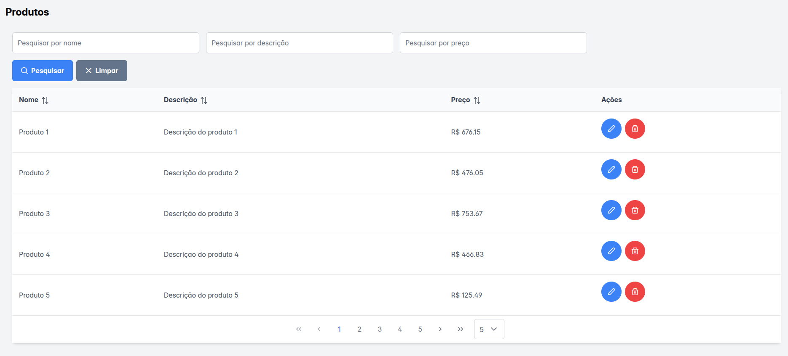
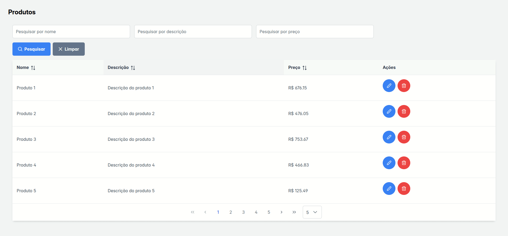
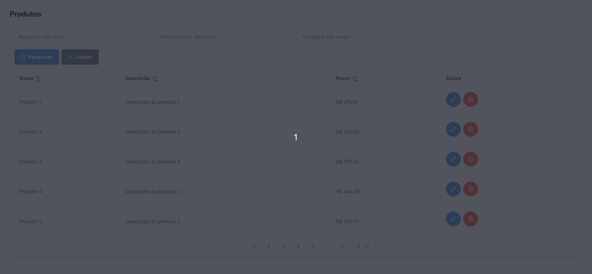
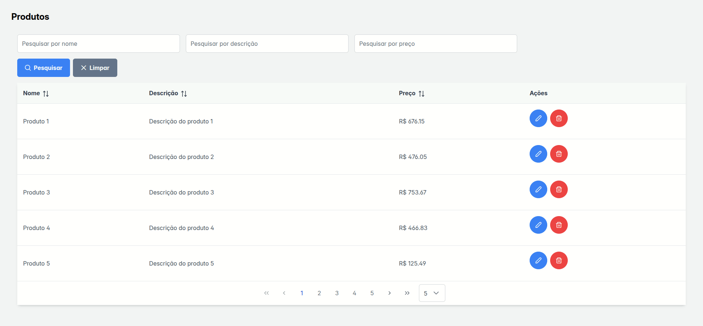

# 📦 Products PrimeReact

Este é um projeto simples de gerenciamento de produtos desenvolvido com **Next.js** e **PrimeReact**. A aplicação foi criada com o objetivo de estudar e aplicar os componentes da biblioteca PrimeReact em um CRUD visualmente rico e funcional.









## 🧭 Índice

- [📦 Products PrimeReact](#-products-primereact)
  - [🧭 Índice](#-índice)
  - [✨ Funcionalidades](#-funcionalidades)
  - [🚀 Tecnologias Utilizadas](#-tecnologias-utilizadas)
  - [📂 Estrutura de Pastas](#-estrutura-de-pastas)
  - [🛠️ Instalação e Execução](#️-instalação-e-execução)
  - [🤓 Objetivo](#-objetivo)
  - [📎 Repositório](#-repositório)
  - [📃 Licença](#-licença)

## ✨ Funcionalidades

- Tela de produtos com:
  - Filtros personalizáveis
  - Botões de ação: **Pesquisar** e **Limpar**
- Listagem de produtos com:
  - Paginação
  - Seleção de total de itens por página
  - Botões de **Edição** e **Remoção**

## 🚀 Tecnologias Utilizadas

- [Next.js](https://nextjs.org/)
- [React](https://react.dev/)
- [PrimeReact](https://primereact.org/)
- [PrimeIcons](https://www.primefaces.org/primeicons/)
- [Tailwind CSS](https://tailwindcss.com/)
- [TypeScript](https://www.typescriptlang.org/)

## 📂 Estrutura de Pastas

```bash
src/
├── app/
├── components/
│   └── products/
│       ├── products-page.tsx              # Página principal de produtos
│       ├── table/
│       │   ├── filter-actions.tsx         # Ações dos filtros
│       │   ├── reusable-table.tsx         # Tabela reutilizável
│       │   ├── table-actions.tsx          # Botões de ação da tabela
│       │   ├── table-filter.tsx           # Filtro da tabela
│       └── ui/
│           └── buttons/
│               ├── clear-button.tsx       # Botão de limpar filtros
│               ├── delete-button.tsx      # Botão de deletar item
│               ├── edit-button.tsx        # Botão de editar item
│               ├── search-button.tsx      # Botão de pesquisa
├── mocks/
│   └── products.ts                        # Dados mockados de produtos
└── types/
    └── products.ts                        # Tipagem do modelo de produto
```

## 🛠️ Instalação e Execução

```bash
# Clone o repositório
git clone https://github.com/joaomacaoli/products-primereact.git

# Acesse o diretório do projeto
cd products-primereact

# Instale as dependências
npm install

# Rode o projeto em ambiente de desenvolvimento
npm run dev
```

A aplicação estará disponível em: [http://localhost:3000](http://localhost:3000)

## 🤓 Objetivo

Este projeto foi desenvolvido durante o feriado de Páscoa como parte dos meus estudos e aprofundamento em **PrimeReact** com **Next.js**. Estou muito feliz por ter aproveitado esse tempo para aprender algo novo e espero aplicar esse conhecimento em projetos futuros!

## 📎 Repositório

🔗 [https://github.com/joaomacaoli/products-primereact](https://github.com/joaomacaoli/products-primereact)

## 📃 Licença

Este projeto está licenciado sob a licença MIT. Veja o arquivo [LICENSE](LICENSE) para mais detalhes.
